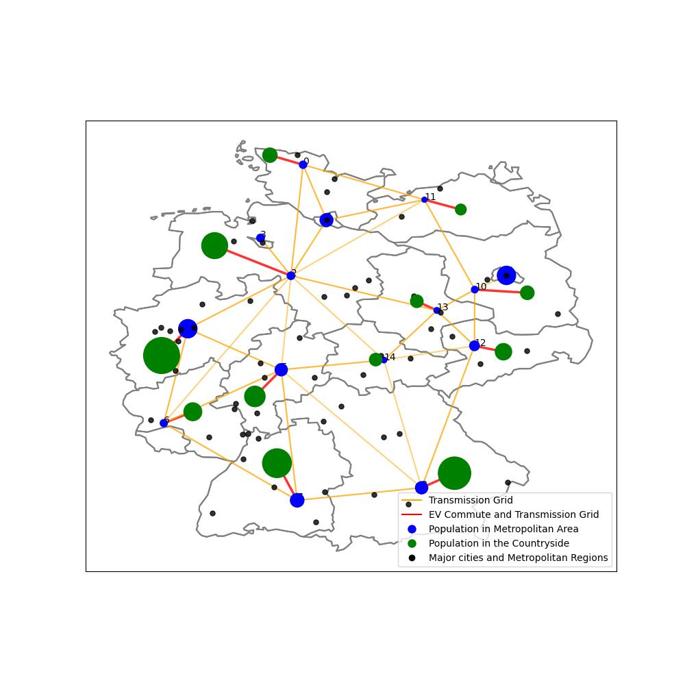
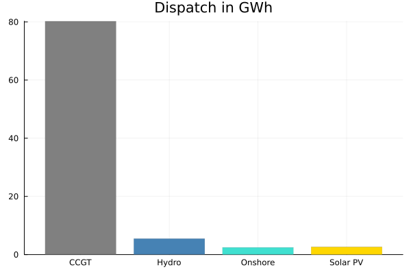
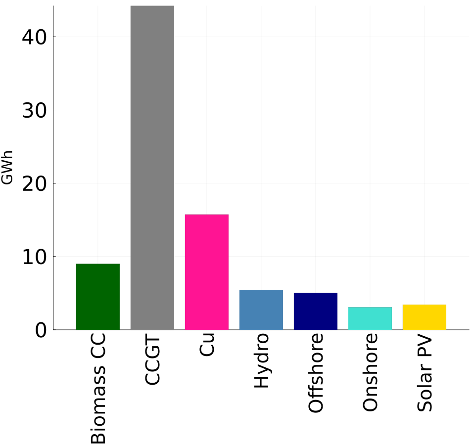
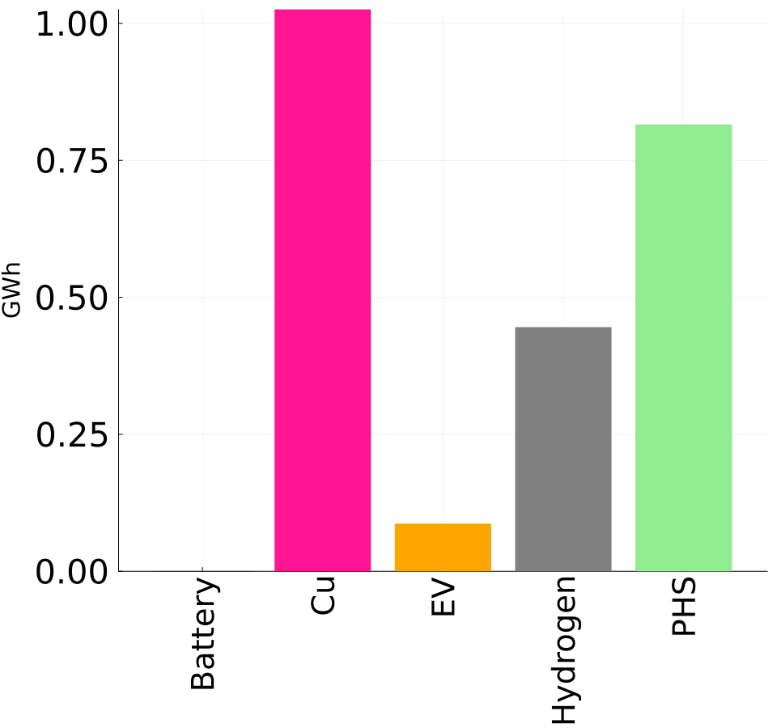
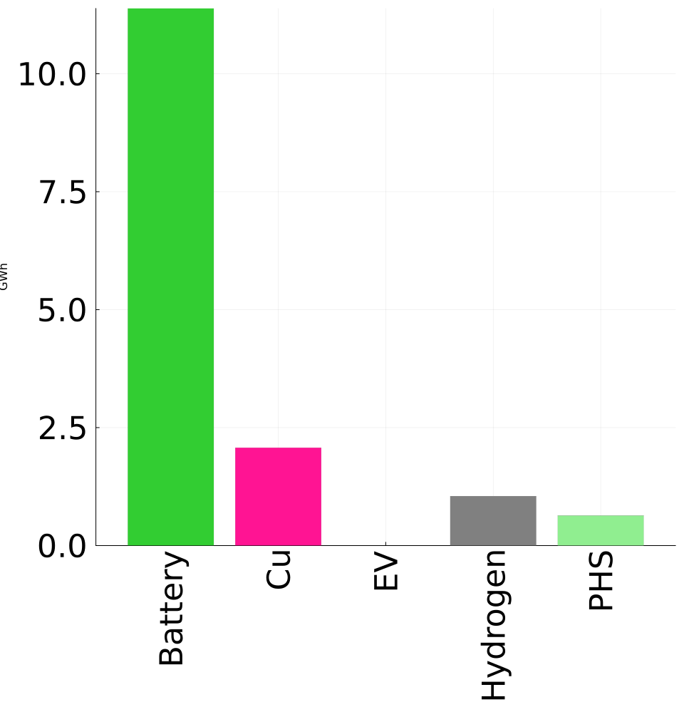

# Energy System Optimization with EV Battery Flexibility

## Technical University of Berlin - Seminar Paper
**Faculty VII (School of Economics and Management)**  
**Workgroup for Infrastructure Policy (WIP)**  
**Operations Research - Methods for Network Engineering**

### Authors
- **Alexander Marx** (0479352)
- **Lorenz Richter** (403607)

### Supervisors
- **Prof. Ph.D. Christian von Hirschhausen**
- **Ph.D. Karlo Hainsch**

---

## Abstract

Electric vehicles (EVs) present a unique opportunity to address renewable energy intermittency through their distributed battery storage capacity. This study develops an optimization framework to analyze how EV charging infrastructure and battery flexibility can enhance grid stability while supporting the transition to renewable energy sources in the German electricity system.

Our research focuses on the interconnection between Germany's urban and rural areas via EVs and Vehicle-to-Grid (V2G) technology, examining how commuting patterns between countryside and cities can provide valuable flexibility services to the power grid.

## Research Questions

1. **How can EV battery flexibility support renewable energy integration?**
2. **What is the optimal spatial distribution of charging infrastructure between rural and urban areas?**
3. **How do different temporal scenarios (2025, 2035, 2045) affect system optimization?**
4. **What are the economic and environmental benefits of coordinated EV charging and V2G services?**
5. **What role do commuting patterns play in providing grid flexibility?**

## Methodology

Our model employs a **mixed-integer linear programming (MILP)** approach to minimize total system costs while optimizing:

- **Power generation** by various technologies (renewable and conventional)
- **Transmission capacity** between regions and offshore wind connections
- **Electric vehicle deployment** and charging/discharging patterns
- **Storage systems** including batteries, pumped hydro, and hydrogen

### Key Model Features:
- **29 distinct regions**: 16 German states split into urban/rural areas (except city-states)
- **Multi-scenario analysis**: 2025, 2035, and 2045 projections
- **Temporal resolution**: Hourly optimization over representative summer/winter days
- **Spatial modeling**: Focus on commuter flows between countryside and cities
- **Technology integration**: Comprehensive representation of generation, storage, and transmission

### Objective Function:
The objective minimizes total annual system cost including generation, transmission, stationary storage and EV (V2G) storage investments:

```math
\begin{equation}
\min_{g_{npt}, G_{np}, F_{nm}, \chi^{S}_{ns}, Z^{S}_{ns}, B^{S}_{ns}, B^{EV}_{nm}}
\quad
\sum_{n \in N} \sum_{p \in P} \sum_{t \in T} c^{g}_{npt} \cdot g_{npt}
+ \sum_{n \in N} \sum_{p \in P} c^{G}_{np} \cdot G_{np}
+ \sum_{n \in N} \sum_{m \in N} c^{F}_{nm} \cdot F_{nm}
+ \sum_{n \in N} \sum_{s \in S} \chi^{S}_{ns} \cdot c^{S,Capex,\chi}_{s}
+ \sum_{n \in N} \sum_{s \in S} Z^{S}_{ns} \cdot c^{S,Capex,Z}_{s}
+ \sum_{n \in N} \sum_{s \in S} B^{S}_{ns} \cdot c^{S,Capex,B}_{s}
+ c^{EV,Capex} \sum_{n \in N} \sum_{m \in N} \frac{B^{EV}_{nm}}{cap^{EV,B}} \tau_{nm}
\end{equation}
```
Subject to constraints for:
- Energy balance and demand satisfaction
- Renewable generation and capacity limits
- EV charging/discharging dynamics and availability
- Storage operation and capacity constraints
- CO₂ emission limitations

### EV Battery (V2G) Constraints
#### State of Charge at t = 0
```math
b^{EV}_{nm0} = \frac{1}{2} B^{EV}_{nm} \tau_{nm}
+ x^{EV}_{nm0} \eta^{EV}_{charge}
- z^{EV}_{nm0} (\eta^{EV}_{discharge})^{-1}
\quad \forall n,m \in N
```
#### State of Charge for t > 0
```math
b^{EV}_{nmt} = b^{EV}_{nm,t-1}
+ x^{EV}_{nmt} \eta^{EV}_{charge}
- z^{EV}_{nmt} (\eta^{EV}_{discharge})^{-1}
\quad \forall n,m \in N,\; \forall t > 0
```
#### EV Energy Capacity Limit
```math
0 \le b^{EV}_{nmt} \le B^{EV}_{nm}
\quad \forall n,m \in N,\; \forall t \in T
```
#### EV Maximum Energy Capacity
```math
0 \le B^{EV}_{nm} \le cap^{B,EV} \tau_{nm}
\quad \forall n,m \in N
```
#### EV Charging Power Limit
```math
0 \le x^{EV}_{nmt} \le \chi^{EV}_{nm} \tau_{nm} \omega_{nmt}
\quad \forall n,m \in N,\; \forall t \in T
```

#### EV Discharging Power Limit
```math
0 \le z^{EV}_{nmt} \le Z^{EV}_{nm} \tau_{nm} \omega_{nmt}
\quad \forall n,m \in N,\; \forall t \in T
```

#### EV Daily Neutrality (No Net Energy Use from Car Owners)
```math
\sum_{t \in T} x^{EV}_{nmt} = \sum_{t \in T} z^{EV}_{nmt}
\quad \forall n,m \in N
```
#### Nodal Power Balance
```math
\begin{aligned}
\sum_{p \in P} g_{npt}
+ \sum_{m \in N} f_{mnt}
+ \sum_{m \in N} V^{EV}_{nm} \omega^{V}_{mnt} z^{EV}_{mnt}
+ \sum_{s \in S} z^{S}_{nst}
=
e_{nt}
+ \zeta_{nt}
+ \sum_{m \in N} f_{nmt}
+ \sum_{m \in N} V^{EV}_{nm} \omega^{V}_{nmt} x^{EV}_{nmt}
+ \sum_{s \in S} x^{S}_{nst}
\quad \forall n \in N,\; \forall t \in T
\end{aligned}
```
### Generation and Transmission Constraints

#### Renewable Generation
```math
g_{npt} = \omega^{RES}_{npt} G_{np}
\quad \forall n \in N,\; \forall p \in P^{RES},\; \forall t \in T
```

#### Renewable Capacity Limit
```math
0 \le G_{np} \le cap^{G}_{np}
\quad \forall n \in N,\; \forall p \in P^{RES}
```

#### Fossil Generation
```math
0 \le g_{npt} \le G_{np}
\quad \forall n \in N,\; \forall p \in P^{F},\; \forall t \in T
```

#### Transmission Capacity
```math
0 \le f_{nmt} \le F_{nm} A_{nm}
\quad \forall n,m \in N,\; \forall t \in T
```

---

### Stationary Storage Constraints

#### State of Charge at t = 0
```math
b^{S}_{ns0} = \frac{1}{2} B^{S}_{ns}
+ x^{S}_{ns0} \eta_{s,charge}
- z^{S}_{ns0} (\eta_{s,discharge})^{-1}
\quad \forall n \in N,\; \forall s \in S
```

#### State of Charge for t > 0
```math
b^{S}_{nst} = b^{S}_{ns,t-1}
+ x^{S}_{nst} \eta_{s,charge}
- z^{S}_{nst} (\eta_{s,discharge})^{-1}
\quad \forall n \in N,\; \forall s \in S,\; \forall t > 0
```

#### Stationary Storage Energy Capacity
```math
0 \le b^{S}_{nst} \le B^{S}_{ns}
\quad \forall n \in N,\; \forall s \in S
```

#### Maximum Installed Stationary Storage Capacity
```math
0 \le B^{S}_{ns} \le cap^{B,S}_{ns}
\quad \forall n \in N,\; \forall s \in S
```

#### Stationary Storage Charging Power
```math
0 \le x^{S}_{nst} \le \chi^{S}_{ns}
\quad \forall n \in N,\; \forall s \in S,\; \forall t \in T
```

#### Stationary Storage Discharging Power
```math
0 \le z^{S}_{nst} \le Z^{S}_{ns}
\quad \forall n \in N,\; \forall s \in S,\; \forall t \in T
```

#### Stationary Storage Daily Neutrality
```math
\sum_{t \in T} x^{S}_{nst} = \sum_{t \in T} z^{S}_{nst}
\quad \forall n \in N,\; \forall s \in S
```

---

### Emission Constraint

#### CO₂ Cap
```math
\sum_{n \in N} \sum_{p \in P} \sum_{t \in T}
g_{npt} \cdot \epsilon^{G}_{p}
\le cap^{CO_2}
```

### 3. Spatial Distribution and Network Analysis


*Figure 6: Model network showing 29 regions with transmission grid connections (yellow lines), EV commute routes (red lines), and population centers (green/blue circles) representing the spatial structure of the German energy system*

**Network Characteristics:**
- **Blue circles**: Metropolitan population centers and major cities
- **Green circles**: Rural population centers and smaller towns  
- **Yellow lines**: Electricity transmission grid connections
- **Red lines**: EV commuting routes between rural and urban areas
- **Black dots**: Additional cities and metropolitan regions


## Technical Implementation

### EV Integration Parameters
- **Energy Consumption**: 0.16 kWh/km (Taljegard et al., 2017)
- **Charging/Discharging Capacity**: 7.4 kW per vehicle
- **Battery Capacity**: 64 kWh per vehicle
- **Efficiency**: 90% roundtrip charging/discharging

### Commuting Patterns
- **Morning commute**: Countryside → City (peak 7-9 AM)
- **Evening return**: City → Countryside (peak 5-7 PM)
- **Availability profiles**: Dynamic based on mobility patterns
- **Geographic coverage**: All 16 German federal states

### Technology Cost Projections

| **Technology** | **2025** | **2035** | **2045** | **Unit** |
|----------------|----------|----------|----------|----------|
| **EV CapEx** | 2,806 | 2,336 | 1,866 | EUR/car/year |
| **Grid CapEx** | 2,266 | 2,383 | 2,331 | EUR/kW/year |
| **Battery Storage** | 515 | 202 | 92 | EUR/kW |
| **Offshore Wind** | 121 | 109 | 102 | EUR/kW |

## Key Findings

### 5.1 Scenario Comparison

| **Metric** | **2025** | **2035** | **Unit** |
|------------|----------|----------|----------|
| **EV System Value** | 129 | 0 | Million EUR |
| **EV Share in Commuting** | 10% | 50% | % of commuters |
| **Renewable Integration** | Medium | High | Qualitative |
| **CCGT Capacity** | ~45 | ~45 | GWh |
| **Storage Dominance** | EV Batteries | Stationary Batteries | Technology |

### Storage Technology Values (Million EUR)

| **Technology** | **2025** | **2035** |
|----------------|----------|----------|
| **EV Batteries** | 129.0 | 0.0 |
| **Stationary Batteries** | 7.9 | 15.4 |
| **Pumped Hydro** | 2.2 | 12.3 |
| **Hydrogen Storage** | 4.2 | 1.9 |

### 5.2 Generation Dispatch

#### Baseline (No V2G)



**Figure 2:** Baseline dispatch without V2G, showing strong CCGT use (~80 GWh) and limited renewable shares.

#### 2025 Scenario with V2G



**Figure 3:** 2025 system with V2G. Renewable penetration increases, biomass emerges as dispatchable capacity (~9 GWh), and CCGT drops to ~45 GWh.

#### 2035 Scenario with V2G


**Figure 4:** 2035 system with V2G. Further renewable expansion with reduced CCGT (~45 GWh). Increased transmission capacity reduces curtailment.

**Technology mix evolution:**

- Renewable shares (wind + solar) increase strongly from 2025 to 2035.
- CCGT remains relevant but declines as a balancing source.
- Biomass becomes a dispatchable renewable supporting daily balancing.
- Grid expansion reduces curtailment and regional price differentials.

---


### 5.3 Storage System Operation

#### 2025 Storage Dispatch



**Figure 5:** Storage dispatch in 2025. EV batteries provide most flexibility (~3.5 GWh), as stationary storage is still limited and costly.

#### 2035 Storage Dispatch



**Figure 6:** Storage dispatch in 2035. Stationary batteries expand to ~11 GWh and become the main flexibility source. Pumped hydro remains stable, hydrogen plays a minor role.

**Storage insights:**

- **2025:** EVs provide significant system value due to lack of stationary storage.
- **2035:** Stationary batteries become cost-competitive, reducing the relative value of V2G.
- Pumped hydro provides a constant contribution across both years.
- Hydrogen has a limited role in short-term balancing.

---

## 6. Interpretation

- V2G provides meaningful system flexibility in early years when stationary battery capacity is low.
- By 2035, large-scale stationary storage reduces reliance on V2G, but V2G still supports peak hours.
- Transmission expansion is a necessary complement to high renewable deployment.
- Combining storage and network reinforcement enables high renewable system operation.

---

## Installation & Usage

### Prerequisites
- Julia 1.8+
- Required packages (automatically installed via Project.toml)

### Getting Started
```julia
# Clone the repository
git clone https://github.com/amarx96/Energy-System-with-EV-Battery-Flexibility.git

# Navigate to project directory  
cd Energy-System-with-EV-Battery-Flexibility

# Activate project environment
julia --project=.

# Install dependencies
] instantiate

# Run optimization model
include("src/main.jl")

# Launch interactive dashboard
include("Dashboard/src/Dashboard.jl")
```

## Repository Structure

```
├── Dashboard/              # Interactive visualization dashboard
│   ├── src/
│   │   ├── Dashboard.jl    # Main dashboard application
│   │   ├── dash_functions.jl # Utility functions for visualizations
│   │   ├── sankey.jl       # Sankey diagram implementations
│   │   └── helper_functions.jl # Supporting utilities
│   └── colors.jl           # Color scheme definitions
├── Data/                   # Input datasets
│   ├── README_DATA.md      # Comprehensive data documentation
│   ├── Commuters.csv       # Inter-regional commuting patterns
│   ├── Regions.csv         # German federal state definitions
│   ├── Capex*.csv          # Technology cost projections by scenario
│   ├── EvCapShare.csv      # EV market penetration assumptions
│   └── ...                 # Additional model input files
├── Graphics/               # Research result visualizations
│   ├── technology_mix_*.png # Energy production analysis
│   ├── storage_mix_*.png   # Storage system comparisons
│   └── network_topology.png # Spatial model representation
├── Project.toml           # Julia package dependencies
├── Manifest.toml          # Exact package versions for reproducibility
├── METHODOLOGY.md         # Detailed mathematical formulation
└── DATA_DOCUMENTATION.md  # Complete data source documentation
```


**Institution:**
Technical University of Berlin  
Faculty VII (School of Economics and Management)  
Workgroup for Infrastructure Policy (WIP)  
Straße des 17. Juni 135, 10623 Berlin, Germany

---

*This repository represents academic work conducted at TU Berlin as part of the Operations Research for Network Infrastructure course
